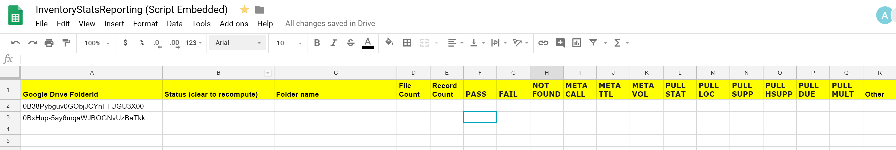
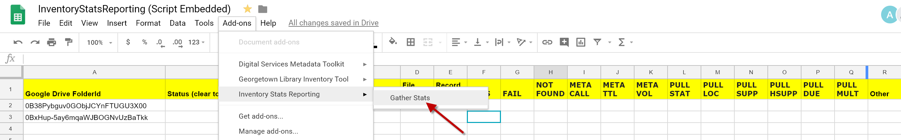
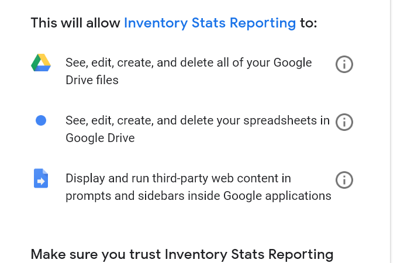
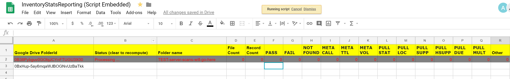
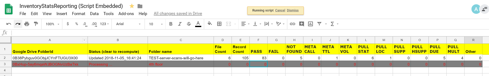
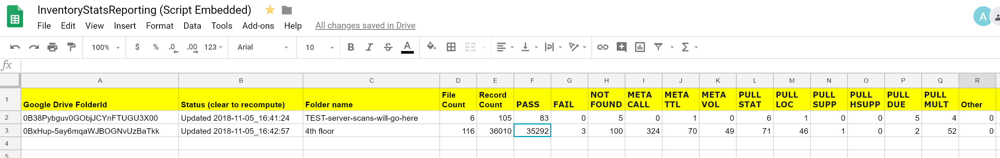
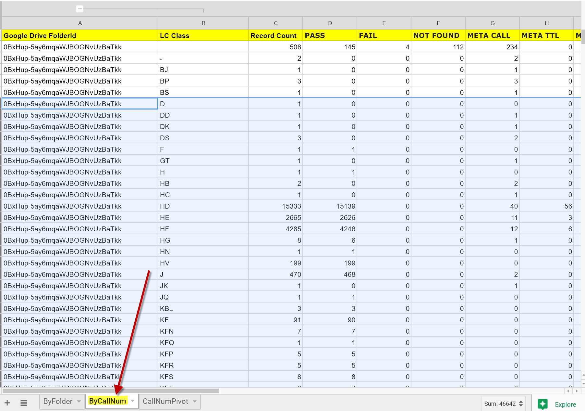

## Generating Stats for the Inventory Process

The following process can be used as a sample solution for reporting metrics on the inventory process.

1. Create a Google Sheet
 - Copy the header row from [InventoryStatsReporting.csv](InventoryStatsReporting.csv)
 - Embed [Code.gs](Code.gs) as a Spreadsheet script
 - Add [ByLCClass.gs](ByLCClass.gs) to the script project

2. Run the "gather stats" option from the Add-On Menu

3. Carefully review the authorization message presented by the script.  
 - Review the code to make sure that you are comfortable granting this access

4. The code will run through each folder and update stats counts

5. If you wish to calculate stats by LC Class, add a worksheet named "ByCallNum"

